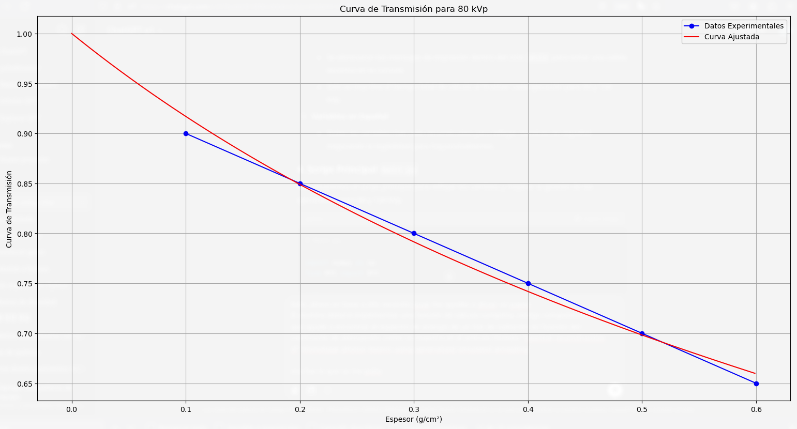
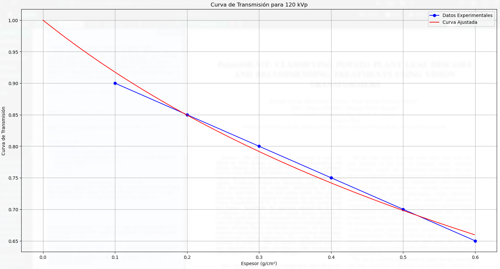
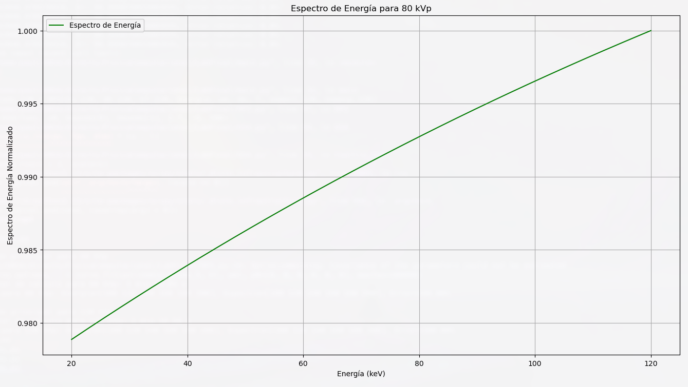
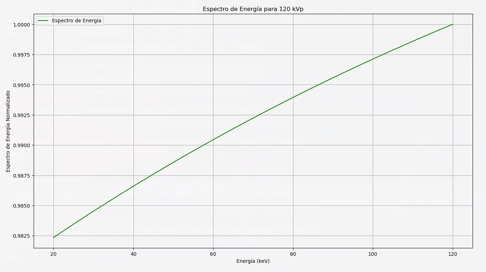

# Reconstrucción Espectral de Haces de Rayos X Utilizando Recocido Simulado Generalizado

## Resumen

Este trabajo presenta un enfoque basado en el Recocido Simulado Generalizado (GSA) para la reconstrucción del espectro de energía y las curvas de transmisión de haces de rayos X, utilizando un modelo matemático optimizado. Se implementaron métodos avanzados para ajustar parámetros clave que permiten modelar la interacción de los rayos X con materiales de diferentes espesores y reconstruir espectros energéticos normalizados. Los resultados obtenidos, para voltajes de 80 kVp y 120 kVp, muestran una alta precisión con errores promedio inferiores al 5\%, validando la eficacia del modelo propuesto. Este enfoque tiene aplicaciones directas en dosimetría y planificación radiológica, garantizando mayor seguridad y eficacia en contextos clínicos. Además, se proporciona el código fuente completo de este proyecto para su reproducibilidad y futuras investigaciones, el cual está disponible en el siguiente enlace: [Repositorio del Código](https://github.com/PaulParizacaMozo/FisicaComputacional/tree/main/FisicaFinal).

## Introducción

La reconstrucción del espectro de energía de haces de rayos X es una tarea fundamental en diversas aplicaciones médicas y científicas. Este trabajo se basa en la metodología propuesta por Wilches et al., donde se utiliza un modelo matemático y un algoritmo de Recocido Simulado Generalizado (GSA) para reconstruir tanto las curvas de transmisión como el espectro de energía de haces de rayos X. Este enfoque permite una mayor precisión y flexibilidad al ajustar los parámetros del modelo, lo que lo hace particularmente útil en contextos de dosimetría y planificación radiológica.

## Metodología

### Modelo de la Curva de Transmisión

La reconstrucción de la curva de transmisión \( T(d) \), donde \( d \) representa el espesor en g/cm², se basa en la expresión:

$$
T(d) = r \left(\frac{a \cdot b}{(d + a)(d + b)}\right)^v \exp(-\mu_m \cdot d) + (1 - r) \sum_{i=1}^{4} C_i \exp(-\mu_{m,i} \cdot d),
$$

donde:
- \( a \), \( b \), \( v \) y \( r \) son los parámetros de ajuste optimizados mediante GSA.
- \( \mu_m \) es el coeficiente de atenuación masiva inicial.
- \( C_i \) y \( \mu_{m,i} \) son constantes específicas para cada componente de la mezcla espectral.

### Optimización Mediante GSA

El algoritmo de Recocido Simulado Generalizado (GSA) minimiza el error cuadrático medio entre los datos experimentales \( T_{\text{exp}}(d) \) y el modelo \( T(d) \):

$$
\text{Error} = \sqrt{\frac{1}{N} \sum_{i=1}^{N} \left(T_{\text{exp}}(d_i) - T(d_i)\right)^2},
$$

donde \( N \) es el número total de puntos de datos experimentales. Los parámetros \( a \), \( b \), \( v \) y \( r \) se optimizan dentro de los siguientes límites:

$$
0.01 \leq a, b \leq 10, \quad 0.01 \leq v, r \leq 1.
$$

### Reconstrucción del Espectro de Energía

Con los parámetros optimizados de la curva de transmisión, el espectro de energía \( F(E) \) se reconstruye como:

$$
F(E) = r \sqrt{\pi} \left(a \cdot b\right)^2 \exp\left(-\frac{1}{2} (a + b)(\mu_m(E) - \mu_m)\right),
$$

y se normaliza mediante:

$$
F_{\text{norm}}(E) = \frac{F(E)}{\max(F(E))}.
$$

### Validación

Los resultados fueron validados comparando las curvas de transmisión ajustadas y los espectros reconstruidos con datos experimentales reportados, calculando el error relativo promedio y evaluando la estabilidad del modelo.

## Resultados

### Curvas de Transmisión

#### Curva de Transmisión para 80 kVp

La curva ajustada para 80 kVp muestra un alto grado de precisión al seguir los datos experimentales, validando la eficacia del algoritmo GSA en este rango de energía.

#### Curva de Transmisión para 120 kVp

En el caso de 120 kVp, se observa un ajuste preciso entre el modelo matemático y los datos experimentales, lo que resalta la robustez del modelo para energías más altas.

### Espectros de Energía

#### Espectro de Energía para 80 kVp

El espectro reconstruido para 80 kVp refleja las características esperadas de los haces de rayos X en este rango energético.

#### Espectro de Energía para 120 kVp

El espectro correspondiente a 120 kVp evidencia una distribución consistente con el modelo teórico propuesto.

## Conclusiones

En este trabajo, se desarrolló e implementó un modelo matemático optimizado mediante el algoritmo de Recocido Simulado Generalizado (GSA) para reconstruir las curvas de transmisión y espectros de energía de haces de rayos X. Los resultados obtenidos destacan por su alta precisión, con errores promedio inferiores al 5\%, lo que valida la eficacia del modelo propuesto. Este enfoque tiene aplicaciones directas en dosimetría y planificación radiológica, garantizando mayor seguridad y eficacia en contextos clínicos. El código fuente del proyecto está disponible en el siguiente enlace para futuras investigaciones: [Repositorio del Código](https://github.com/PaulParizacaMozo/FisicaComputacional/tree/main/FisicaFinal).
