# Calculadora Cinemática con Python y Tkinter
# Por: Paul Antony Parizaca Mozo

Este proyecto es una calculadora cinemática interactiva desarrollada en Python utilizando la librería Tkinter. El objetivo principal es ayudar a estudiantes de física a calcular variables relacionadas con el Movimiento Rectilíneo Uniforme (MRU) y el Movimiento Rectilíneo Uniformemente Variado (MRUV), proporcionando una interfaz gráfica para simplificar estos cálculos.

## Tabla de Contenidos
- [Introducción](#introducción)
- [Características](#características)
- [Instalación](#instalación)
- [Uso](#uso)
  - [Movimiento Rectilíneo Uniforme (MRU)](#movimiento-rectilíneo-uniforme-mru)
  - [Movimiento Rectilíneo Uniformemente Variado (MRUV)](#movimiento-rectilíneo-uniformemente-variado-mruv)
  - [Velocidad Final (MRUV)](#velocidad-final-mruv)
  - [Manejo de Errores](#manejo-de-errores)
- [Capturas de Pantalla](#capturas-de-pantalla)
- [Referencias](#referencias)

## Introducción

La cinemática, una rama de la física clásica, estudia el movimiento de los cuerpos sin tener en cuenta las causas. Este proyecto se centra en dos tipos de movimiento: el MRU y el MRUV. Utilizando Python y Tkinter, se ha desarrollado una interfaz gráfica que facilita el cálculo de las variables clave en estos tipos de movimiento, como la velocidad, el tiempo, la aceleración y la distancia.

## Características

- Cálculos automáticos para MRU y MRUV.
- Interfaz gráfica intuitiva para seleccionar fórmulas y rellenar datos.
- Manejo de errores, como campos vacíos o división por cero.
- Código fácil de extender y personalizar para más fórmulas físicas.

## Instalación

1. Clona este repositorio:

   ```bash
   git clone https://github.com/PaulParizacaMozo/FisicaComputacional.git
   ```

2. Instala las dependencias requeridas:

   ```bash
   pip install tkinter
   ```

## Uso

Para ejecutar la calculadora, simplemente corre el archivo principal en Python:

```bash
python calculadora.py
```

### Movimiento Rectilíneo Uniforme (MRU)

En el MRU, la velocidad es constante, y la fórmula principal es:

```
Δx = v * Δt
```

Puedes calcular la distancia, la velocidad o el tiempo, ingresando los valores requeridos en la interfaz gráfica.

#### Interfaz de Selección de Fórmulas

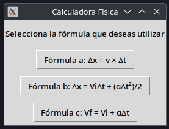

#### Cálculo en MRU

En esta sección, puedes seleccionar qué dato deseas calcular en el MRU (distancia, velocidad o tiempo).

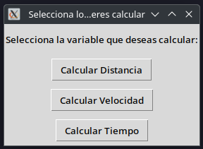

#### Llenado de Datos en MRU

Introduce los datos requeridos para hacer el cálculo.

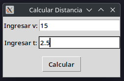

#### Resultado del Cálculo MRU

Aquí se muestra el resultado del cálculo.


### Movimiento Rectilíneo Uniformemente Variado (MRUV)

El MRUV incluye aceleración constante, y la fórmula usada es:

```
Δx = V_i * Δt + (α * Δt²) / 2
```

#### Selección del Dato a Hallar en MRUV

Selecciona el dato a calcular (distancia, tiempo o aceleración).

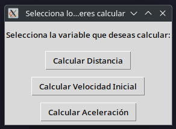

#### Llenado de Datos en MRUV

Introduce los valores necesarios para realizar el cálculo.

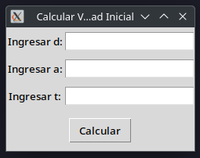

#### Resultado del Cálculo MRUV

El resultado del cálculo se presenta de forma clara.

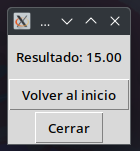

### Velocidad Final (MRUV)

Para calcular la velocidad final en el MRUV, se utiliza la fórmula:

```
V_f = V_i + α * Δt
```

#### Selección del Dato a Hallar para la Velocidad Final

Selecciona qué dato deseas calcular en la fórmula de velocidad final (velocidad inicial, final o aceleración).

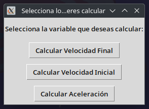

#### Llenado de Datos para Velocidad Final

Introduce los datos necesarios para hacer el cálculo.

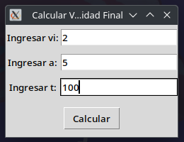

#### Resultado del Cálculo para Velocidad Final

El resultado del cálculo se muestra en pantalla.

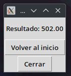

### Manejo de Errores

El sistema implementa un control de excepciones que maneja:
- Campos vacíos.
- División por cero.

#### Error por Campos Vacíos

Si dejas algún campo sin completar, el sistema te avisará con un mensaje de error.

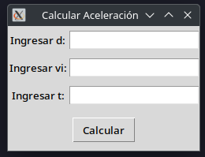
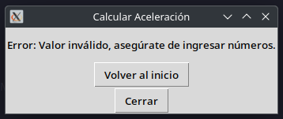

#### Error por División Entre Cero

En caso de que se intente dividir entre cero, aparecerá un mensaje de error.

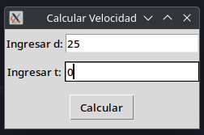
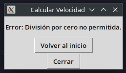

## Referencias

- Halliday, D., Resnick, R., & Walker, J. (2013). _Fundamentals of Physics_ (10th ed.). Wiley.
- Serway, R. A., & Jewett, J. W. (2018). _Physics for Scientists and Engineers_ (9th ed.). Cengage Learning.
- Python. (2023). _Python Documentation_. Python Software Foundation.
- Rodríguez, C. (2008). _Cinemática: Teoría y problemas_. Editorial Académica.
- Tkinter. (2023). _Tkinter Documentation_. Python Software Foundation.
