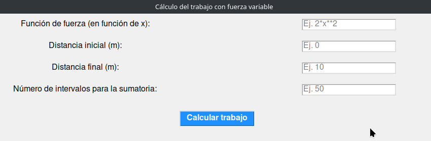
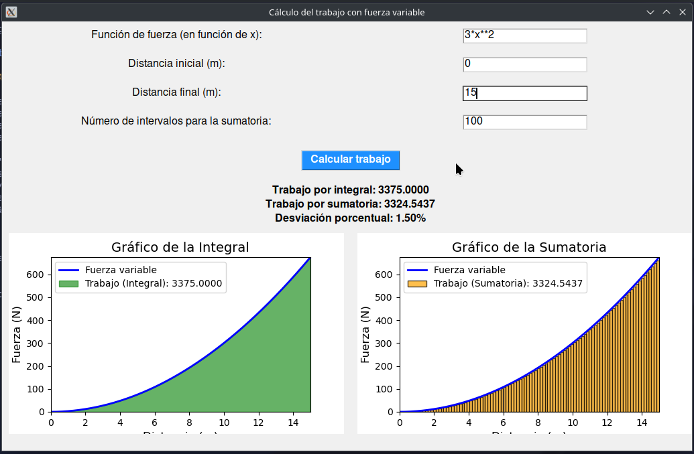
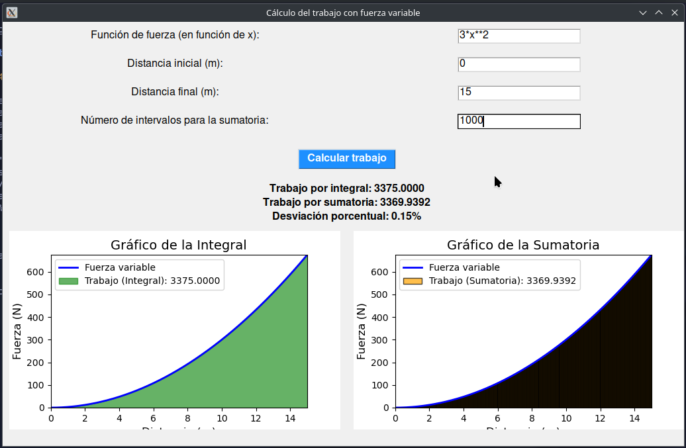

# Cálculo del Trabajo con Fuerza Variable - Práctica de Laboratorio 4

### Por:
Paul Antony Parizaca Mozo

---

## Descripción

Este proyecto implementa un programa en Python para calcular el trabajo realizado por una fuerza variable usando dos métodos:

1. **Cálculo exacto mediante la integral definida**.
2. **Aproximación numérica mediante sumatoria**.

El objetivo es comparar ambos métodos y calcular la desviación porcentual entre ellos. Además, el programa genera gráficos para visualizar el trabajo calculado tanto por la integral como por la sumatoria.

---

## Requisitos

Para ejecutar este proyecto, necesitarás instalar las siguientes bibliotecas de Python:

```bash
pip install numpy matplotlib scipy tkinter
```

---

## Instrucciones de Ejecución

1. **Clonar el repositorio**:

   ```bash
   git clone https://github.com/PaulParizacaMozo/FisicaComputacional.git
   ```

2. **Ejecutar el programa principal**:

   Accede al directorio `Laboratorio04` y ejecuta el archivo principal:

   ```bash
   cd Laboratorio04
   python main.py
   ```

---

## Informe del Laboratorio

### Introducción

El trabajo realizado por una fuerza variable es un concepto fundamental en la física. Este proyecto tiene como objetivo implementar un programa en Python que permita calcular dicho trabajo utilizando tanto el método exacto (integral definida) como una aproximación numérica (sumatoria). El enfoque se centra en evaluar la precisión de la sumatoria en comparación con la integral, utilizando la desviación porcentual entre ambos resultados.

### Marco Teórico

El trabajo \( W \) realizado por una fuerza variable \( \vec{F} \) a lo largo de una trayectoria se calcula mediante la siguiente integral:

$$
W = \int_{\vec{r}_A}^{\vec{r}_B} \vec{F} \cdot d\vec{r}
$$

Cuando la integración analítica no es posible, se utiliza la **sumatoria de Riemann** para aproximar el trabajo. Esta sumatoria divide el intervalo de integración en subintervalos más pequeños y suma las áreas de los rectángulos:

$$
W \approx \sum_{i=1}^{n} F(x_i) \Delta x
$$

La precisión de la sumatoria depende directamente del número de intervalos utilizados. Para evaluar su precisión, calculamos la **desviación porcentual** entre el resultado de la sumatoria y el de la integral.

---

### Desarrollo

El proyecto se desarrolla en Python y se estructura en las siguientes etapas:

#### 1. Inicialización del Proyecto

El programa permite al usuario ingresar una función de fuerza en términos de \( x \), la distancia inicial y final, y el número de intervalos para la aproximación por sumatoria. 

El archivo `main.py` contiene la interfaz gráfica desarrollada con `Tkinter`, donde se reciben estos inputs. En segundo plano, los cálculos de la integral y la sumatoria se realizan en `utils.py`.

```python
import tkinter as tk
from tkinter import messagebox
from utils import evaluar_fuerza, calcular_sumatoria, calcular_integral
```

#### 2. Interfaz Gráfica

Se utilizó `Tkinter` para desarrollar la interfaz gráfica que permite a los usuarios ingresar los datos necesarios para los cálculos:

- **Función de la fuerza**: La función debe estar en términos de \( x \) (por ejemplo, `3*x^2`).
- **Distancia inicial y final**.
- **Número de intervalos** para la aproximación por sumatoria.



#### 3. Cálculo del Trabajo mediante Integral

El cálculo exacto del trabajo se realiza utilizando la función `quad` de `scipy.integrate` para evaluar la integral:

```python
from scipy.integrate import quad

def calcular_integral(fuerza_str, x_inicial, x_final):
    def fuerza(x):
        return eval(fuerza_str)
    trabajo_integral, _ = quad(fuerza, x_inicial, x_final)
    return trabajo_integral
```

#### 4. Cálculo del Trabajo mediante Sumatoria

La aproximación numérica se realiza dividiendo el intervalo en subintervalos y calculando la sumatoria de las áreas de los rectángulos:

```python
def calcular_sumatoria(fuerza_str, x_inicial, x_final, n_intervalos):
    dx = (x_final - x_inicial) / n_intervalos
    x_vals = np.linspace(x_inicial, x_final, n_intervalos)
    fuerza_vals = [eval(fuerza_str) for x in x_vals]
    trabajo_sumatoria = sum(f * dx for f in fuerza_vals)
    return trabajo_sumatoria
```

#### 5. Visualización Gráfica

El programa genera dos gráficos comparativos utilizando `matplotlib`. Uno muestra el área bajo la curva (integral), y el otro las columnas correspondientes a la sumatoria.

```python
import matplotlib.pyplot as plt

def actualizar_grafico(fuerza_str, x_inicial, x_final, n_intervalos, trabajo_integral, trabajo_sumatoria):
    x_vals = np.linspace(x_inicial, x_final, 1000)
    y_vals = evaluar_fuerza(fuerza_str, x_vals)
    
    # Gráfico de la integral
    ax_integral.plot(x_vals, y_vals, label="Fuerza variable", color='blue')
    ax_integral.fill_between(x_vals, 0, y_vals, color='green', alpha=0.6)

    # Gráfico de la sumatoria
    ax_sumatoria.bar(x_vals, y_vals, width=dx, color='orange', edgecolor='black')
```

---

### Ejemplo de Ejecución: Fuerza Cuadrática

#### Ejecución con 100 Intervalos

Parámetros:

- **Función de la fuerza**: \( F(x) = 3x^2 \)
- **Distancia**: \( 0 \, \text{m} \leq x \leq 15 \, \text{m} \)
- **Número de intervalos**: 100

Resultados:

- **Trabajo por Integral**: \( 3375 \, \text{J} \)
- **Trabajo por Sumatoria**: \( 3324.54 \, \text{J} \)
- **Desviación porcentual**: 1.50%



#### Ejecución con 1000 Intervalos

Parámetros:

- **Función de la fuerza**: \( F(x) = 3x^2 \)
- **Distancia**: \( 0 \, \text{m} \leq x \leq 15 \, \text{m} \)
- **Número de intervalos**: 1000

Resultados:

- **Trabajo por Integral**: \( 3375 \, \text{J} \)
- **Trabajo por Sumatoria**: \( 3369.94 \, \text{J} \)
- **Desviación porcentual**: 0.15%



---

### Conclusión

Este laboratorio permitió comparar el cálculo del trabajo mediante la integral y la sumatoria. La sumatoria ofrece una aproximación que se vuelve más precisa conforme aumenta el número de intervalos. Sin embargo, la integral proporciona el valor exacto. A través de la desviación porcentual y las visualizaciones gráficas, se demostró cómo las aproximaciones numéricas pueden ser ajustadas para mejorar la precisión del cálculo.
