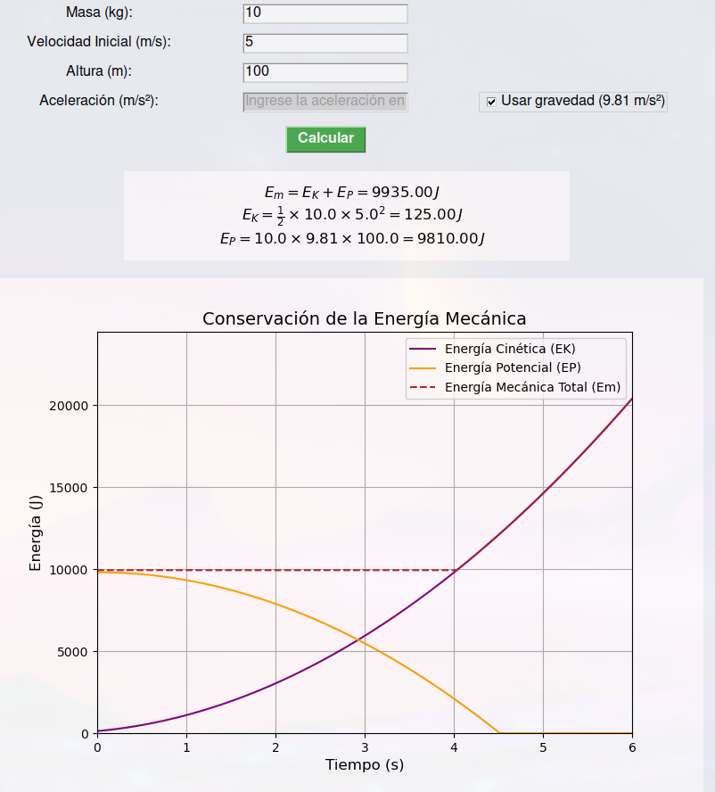

# Laboratorio 5: Conservación de la Energía Mecánica

## Introducción

En esta práctica de laboratorio, se busca profundizar en el concepto de conservación de la energía mecánica (E_m), explorando cómo esta es el resultado de la interacción entre la energía cinética (E_K) y la energía potencial gravitatoria (E_P). En física clásica, la conservación de la energía mecánica es un principio fundamental: en un sistema cerrado y sin pérdidas de energía por factores externos como la fricción, la suma de E_K y E_P se mantiene constante a lo largo del tiempo.

Para el desarrollo de esta práctica, se implementó un código en Python que permite visualizar la conservación de E_m a través de gráficos en función de E_K y E_P. Este enfoque computacional facilita la observación directa de los conceptos teóricos de conservación de la energía mecánica, empleando simulaciones que generan datos y gráficos a partir de las ecuaciones de energía.

## Marco Teórico

### Energía Mecánica (E_m)

La energía mecánica es la capacidad de un sistema para realizar trabajo debido a su movimiento o posición. En sistemas sin pérdidas de energía, la energía mecánica se conserva, es decir, la suma de la energía cinética (E_K) y la energía potencial (E_P) permanece constante. Este principio permite analizar el comportamiento de objetos en movimiento bajo fuerzas conservativas, como la gravedad.

### Energía Cinética (E_K)

La energía cinética de un objeto en movimiento se define como:

$$
E_K = \frac{1}{2}mv^2
$$

donde (m) es la masa del objeto y (v) su velocidad. Esta energía cambia proporcionalmente al cuadrado de la velocidad del objeto, lo que permite observar cómo varía conforme el objeto acelera o desacelera debido a la gravedad.

### Energía Potencial Gravitatoria (E_P)

La energía potencial gravitatoria está relacionada con la posición de un objeto en un campo gravitacional y se define como:

$$
E_P = mgh
$$

donde m es la masa del objeto, g es la aceleración gravitacional y h es la altura del objeto respecto a un punto de referencia. A medida que el objeto cae, su E_P disminuye mientras su E_K aumenta.

### Conservación de la Energía Mecánica

El principio de conservación de la energía mecánica establece que, en un sistema cerrado sin fuerzas no conservativas, la suma de E_K y E_P es constante:

$$
E_m = E_K + E_P
$$

Este principio es fundamental en la física clásica y permite predecir el comportamiento de los objetos en caída libre, donde E_P se convierte gradualmente en E_K, manteniendo E_m constante.

### Simulación Computacional de la Energía Mecánica

La simulación se implementa en Python utilizando las bibliotecas `NumPy` y `Matplotlib` para cálculos y visualización de resultados. Estas herramientas permiten observar en tiempo real cómo varían E_K y E_P, proporcionando una representación gráfica de la conservación de E_m en un sistema ideal.

## Desarrollo

### Inicialización del Proyecto

Para simular la conservación de E_m y observar la relación entre E_K y E_P, se empleó Python con bibliotecas científicas.

#### Requerimientos

- **Python 3.10**
- **NumPy**: Para cálculos numéricos.
- **Matplotlib**: Para visualización de gráficos.
- **Tkinter**: Para la interfaz gráfica (GUI).

#### Instalación de Bibliotecas

Ejecuta el siguiente comando para instalar las bibliotecas necesarias:

```bash
pip install numpy matplotlib tk
```

#### Importación de Bibliotecas

En el código se importan las siguientes bibliotecas:

```python
import numpy as np
import matplotlib.pyplot as plt
from tkinter import Tk, Label, Entry, Button, Checkbutton, BooleanVar
from matplotlib.backends.backend_tkagg import FigureCanvasTkAgg
```

### Definición de Ecuaciones de Energía

Las ecuaciones implementadas en el código son:

- **Energía Mecánica Total**:  E_m = E_K + E_P 
- **Energía Cinética**: 
  $$
  E_K = \frac{1}{2}mv^2
  $$
- **Energía Potencial**: 
  $$
  E_P = m \cdot g \cdot h
  $$

### Cálculo de Energías en Python

El programa calcula E_K, E_P, y E_m en cada instante de tiempo:

```python
# Constantes
g = 9.81  # Aceleración gravitacional

# Inicialización de listas para almacenar valores
EK_values = []
EP_values = []
Em_values = []

# Cálculo de energías
for t in time:
    h = max(0, altura - 0.5 * g * t**2)  # Altura en cada instante
    v = velocidad_inicial + g * t        # Velocidad en cada instante
    EK = 0.5 * masa * v**2
    EP = masa * g * h
    Em = EK + EP
    EK_values.append(EK)
    EP_values.append(EP)
    Em_values.append(Em)
```

### Visualización de la Conservación de la Energía Mecánica

La energía mecánica total, junto con E_K y E_P, se visualizan mediante `Matplotlib`:

```python
import matplotlib.pyplot as plt

fig, ax = plt.subplots()
ax.plot(time, EK_values, label="Energía Cinética (EK)", color='purple')
ax.plot(time, EP_values, label="Energía Potencial (EP)", color='orange')
ax.plot(time, Em_values, label="Energía Mecánica Total (Em)", color='brown', linestyle='--')
ax.set_xlabel("Tiempo (s)")
ax.set_ylabel("Energía (J)")
ax.set_title("Conservación de la Energía Mecánica")
ax.legend()
plt.show()
```

## Ejecución del Programa

### Inputs Requeridos

Los valores de entrada necesarios para la simulación son:

- **Masa (kg)**: Masa del objeto en movimiento.
- **Velocidad Inicial (m/s)**: Velocidad con la que el objeto comienza su movimiento.
- **Altura Inicial (m)**: Altura desde la cual el objeto inicia su desplazamiento.
- **Aceleración (m/s²)**: Aceleración del objeto (por defecto es la gravedad, 9.81 m/s^2.

#### Ejemplo de Pantalla de Inputs


### Ejemplo de Ejecución

Para probar el programa, utiliza el siguiente ejemplo:

- **Masa**: 10 kg
- **Velocidad Inicial**: 5m/s
- **Altura Inicial**: 100 m
- **Aceleración**: 9.81 m/s^2

#### Resultado de la Simulación



En este caso, el programa calcula la energía cinética y la energía potencial gravitatoria en cada instante de tiempo. La gráfica resultante muestra cómo E_K aumenta y E_P disminuye, mientras E_m se mantiene constante, validando el principio de conservación de la energía mecánica en un sistema ideal.

## Conclusión

Este laboratorio permitió implementar una simulación de la conservación de la energía mecánica, mostrando visualmente cómo E_K y E_P interactúan en un sistema ideal. La práctica facilitó la verificación del principio de conservación de E_m, proporcionando un recurso visual y analítico que refuerza la comprensión de los conceptos físicos.

Gracias al uso de herramientas computacionales en Python y al desarrollo de una interfaz gráfica, se obtuvo una representación clara del intercambio de energía. La simulación del meteorito en caída libre permitió visualizar de forma práctica cómo los conceptos teóricos se aplican en situaciones físicas complejas, destacando el valor de estas herramientas en el aprendizaje de la física.

## Referencias

- Arenas Gaviria, B. (2017). *Momento Lineal, Fuerza y Energía Mecánica*. Universidad de Antioquia, Instituto de Física.
- MIT OpenCourseWare. (2022). *Chapter 13: Energy, Kinetic Energy, and Work*, 8.01 Classical Mechanics, Spring 2022.
- Tipler, P. A., & Mosca, G. (2005). *Física para la ciencia y la tecnología*, Volumen 1. Reverte.
