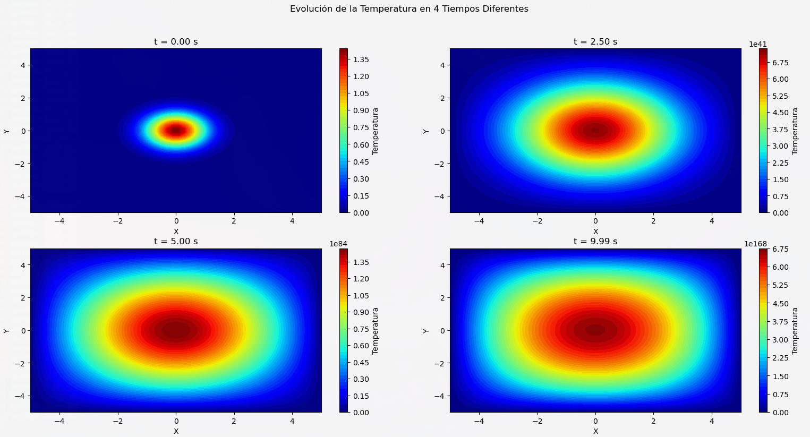
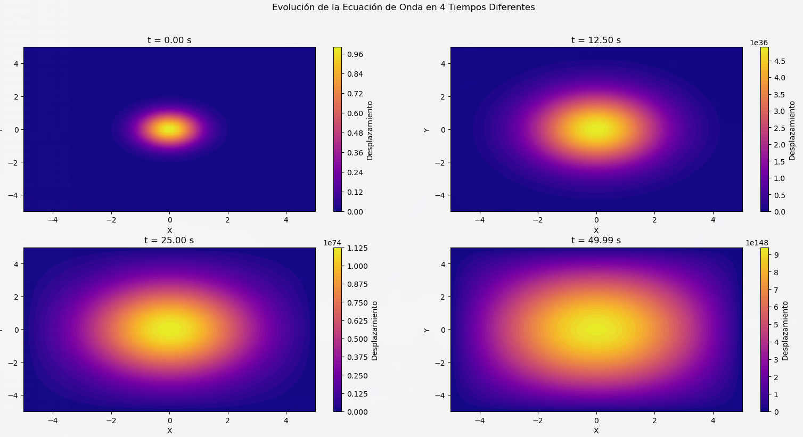

# Laboratorio 6 - Solución de Ecuaciones Diferenciales con Diferencias Finitas

## Introducción

Este laboratorio tiene como objetivo estudiar soluciones de ecuaciones diferenciales parciales (EDPs) mediante el método de diferencias finitas, específicamente aplicado a la ecuación de calor y la ecuación de onda. Estas ecuaciones son fundamentales en la física y en la ingeniería, ya que modelan fenómenos como la difusión de temperatura en materiales y la propagación de ondas en medios elásticos. A través de la implementación de simulaciones en Python, se lograron visualizaciones que permiten observar la evolución de estos fenómenos en el tiempo.

## Marco Teórico

### Ecuaciones Diferenciales Parciales

Las ecuaciones diferenciales parciales (EDPs) involucran derivadas de una función en varias variables. En este laboratorio, abordamos la ecuación de calor y la ecuación de onda, las cuales describen fenómenos de difusión y propagación, respectivamente.

### Método de Diferencias Finitas

El método de diferencias finitas permite aproximar las derivadas en una EDP mediante diferencias en una malla discreta de puntos. Esto transforma la EDP en un sistema de ecuaciones algebraicas, facilitando su resolución numérica en el dominio definido.

### Ecuación de Calor

La ecuación de calor describe la difusión de temperatura en un medio y se representa en una dimensión como:

$$
\frac{\partial u}{\partial t} = \alpha \frac{\partial^2 u}{\partial x^2}
$$


donde \( u(x, t) \) es la temperatura en el punto \( x \) y en el tiempo \( t \), y \( \alpha \) es el coeficiente de difusividad térmica. En el laboratorio, utilizamos un esquema de diferencias finitas en 2D:

$$
u_{i,j}^{n+1} = (1 - 2r) u_{i,j}^n + r (u_{i+1,j}^n + u_{i-1,j}^n + u_{i,j+1}^n + u_{i,j-1}^n)
$$

con \( r = \frac{dt}{dx^2} \) como parámetro de estabilidad.

### Ecuación de Onda

La ecuación de onda describe la propagación de perturbaciones, como ondas sonoras o vibraciones. En una dimensión, se expresa como:


$$
\frac{\partial^2 u}{\partial t^2} = c^2 \frac{\partial^2 u}{\partial x^2}
$$


donde \( u(x, t) \) es el desplazamiento en el punto \( x \) y en el tiempo \( t \), y \( c \) es la velocidad de propagación. En el laboratorio, empleamos el esquema de diferencias finitas en 2D:


$$
u_{i,j}^{n+1} = 2(1 - r^2) u_{i,j}^n + r^2 (u_{i+1,j}^n + u_{i-1,j}^n + u_{i,j+1}^n + u_{i,j-1}^n) - u_{i,j}^{n-1}
$$


con \( r = \frac{dt}{dx} \) como número de Courant, fundamental para la estabilidad.

## Desarrollo

### Simulación de la Ecuación de Calor

Para simular la ecuación de calor, se definieron los límites del dominio en los ejes \( X \) y \( Y \) de \(-5\) a \(5\), con una malla de \(50 \times 50\) puntos y un paso de tiempo de \( dt = 0.01 \) segundos. La condición inicial se estableció como una distribución gaussiana centrada en el origen \((0,0)\), lo cual representa una fuente de calor que se difunde en el tiempo.

#### Código de la Ecuación de Calor

```python
import numpy as np
import matplotlib.pyplot as plt

# Definición del dominio y parámetros
Ua, Ub = -5, 5
Uc, Ud = -5, 5
Nx, Ny = 50, 50
dx = (Ub - Ua) / (Nx - 1)
dt = 0.01
T_max = 10
r = dt / (dx**2)

# Condición inicial
x_centro, y_centro = 0.0, 0.0
x = np.linspace(Ua, Ub, Nx)
y = np.linspace(Uc, Ud, Ny)
X, Y = np.meshgrid(x, y)
u = np.exp(-((X - x_centro)**2 + (Y - y_centro)**2))

# Esquema de diferencias finitas
def solve_heat_equation(u, r, Nx, Ny, T_max, dt, times_to_capture):
    num_steps = int(T_max / dt)
    u_new = u.copy()
    captured_frames = []
    for n in range(num_steps):
        for i in range(1, Nx - 1):
            for j in range(1, Ny - 1):
                u_new[i, j] = (1 - 2 * r) * u[i, j] + r * (u[i+1, j] + u[i-1, j] + u[i, j+1] + u[i, j-1])
        u = u_new.copy()
        if n in times_to_capture:
            captured_frames.append((u.copy(), n * dt))
    return captured_frames

# Visualización de resultados
times_to_capture = [0, int(0.25 * T_max / dt), int(0.5 * T_max / dt), int(T_max / dt) - 1]
frames = solve_heat_equation(u, r, Nx, Ny, T_max, dt, times_to_capture)

fig, axes = plt.subplots(2, 2, figsize=(12, 10))
for ax, (frame, time) in zip(axes.flatten(), frames):
    contour = ax.contourf(X, Y, frame, levels=50, cmap="jet")
    ax.set_title(f"t = {time:.2f} s")
    fig.colorbar(contour, ax=ax, label="Temperatura")
plt.show()
```

#### Resultados de la Ecuación de Calor

La evolución de la temperatura en el tiempo se muestra en cuatro instantes: \(t = 0\), \(t = 2.5\), \(t = 5.0\) y \(t = 10.0\) segundos.



### Simulación de la Ecuación de Onda

Para la ecuación de onda, se utilizó un número de Courant adecuado para mantener la estabilidad. La condición inicial fue una perturbación gaussiana centrada en \((0, 0)\), la cual se propaga hacia los bordes.

#### Código de la Ecuación de Onda

```python
import numpy as np
import matplotlib.pyplot as plt

# Definición del dominio y parámetros
Ua, Ub = -5, 5
Uc, Ud = -5, 5
Nx, Ny = 50, 50
dx = (Ub - Ua) / (Nx - 1)
dt = 0.01
T_max = 50
r = dt / dx

# Condición inicial
x_centro, y_centro = 0.0, 0.0
u_prev = np.exp(-((X - x_centro)**2 + (Y - y_centro)**2))
u = u_prev.copy()

# Esquema de diferencias finitas
def solve_wave_equation(u, u_prev, r, Nx, Ny, T_max, dt, times_to_capture):
    num_steps = int(T_max / dt)
    u_next = np.zeros_like(u)
    captured_frames = []
    for n in range(num_steps):
        for i in range(1, Nx - 1):
            for j in range(1, Ny - 1):
                u_next[i, j] = 2 * (1 - r**2) * u[i, j] + r**2 * (u[i+1, j] + u[i-1, j] + u[i, j+1] + u[i, j-1]) - u_prev[i, j]
        u_prev, u = u, u_next.copy()
        if n in times_to_capture:
            captured_frames.append((u.copy(), n * dt))
    return captured_frames

# Visualización de resultados
times_to_capture = [0, int(0.25 * T_max / dt), int(0.5 * T_max / dt), int(T_max / dt) - 1]
frames = solve_wave_equation(u, u_prev, r, Nx, Ny, T_max, dt, times_to_capture)

fig, axes = plt.subplots(2, 2, figsize=(12, 10))
for ax, (frame, time) in zip(axes.flatten(), frames):
    contour = ax.contourf(X, Y, frame, levels=50, cmap="plasma")
    ax.set_title(f"t = {time:.2f} s")
    fig.colorbar(contour, ax=ax, label="Desplazamiento

")
plt.show()
```

#### Resultados de la Ecuación de Onda

La evolución del desplazamiento de la onda se muestra en cuatro tiempos: \(t = 0\), \(t = 12.5\), \(t = 25.0\) y \(t = 50.0\) segundos.



### Interpretación de los Resultados

En ambas simulaciones, los límites del dominio (\( Ua, Ub, Uc, Ud \)) definen el área donde la función \( u(x, y, t) \) existe. Fuera de estos límites, la solución no se considera.

- **Ecuación de Calor**: La temperatura se difunde desde el centro hacia los bordes, simulando un proceso de equilibrio térmico. La condición inicial centrada en \( (0,0) \) genera una temperatura máxima en el centro que se disipa con el tiempo.
  
- **Ecuación de Onda**: La perturbación inicial se propaga en forma de ondas hacia los bordes, representando un sistema de propagación de ondas en un medio. Los bordes actúan como límites fijos donde la función se anula.

## Conclusiones

1. La ecuación de calor demostró la difusión de temperatura en un medio homogéneo, alcanzando un estado de equilibrio.
2. La ecuación de onda mostró la propagación de una perturbación como ondas expansivas.
3. Los parámetros de estabilidad como \( r \) y el número de Courant fueron esenciales para evitar inestabilidades en las simulaciones.
4. El método de diferencias finitas fue efectivo para resolver estas EDPs.
5. Python y sus bibliotecas facilitaron tanto los cálculos como la visualización de los resultados.

Este laboratorio permitió comprender los fenómenos de difusión y propagación, así como la utilidad de las simulaciones numéricas en el análisis de ecuaciones diferenciales parciales.
