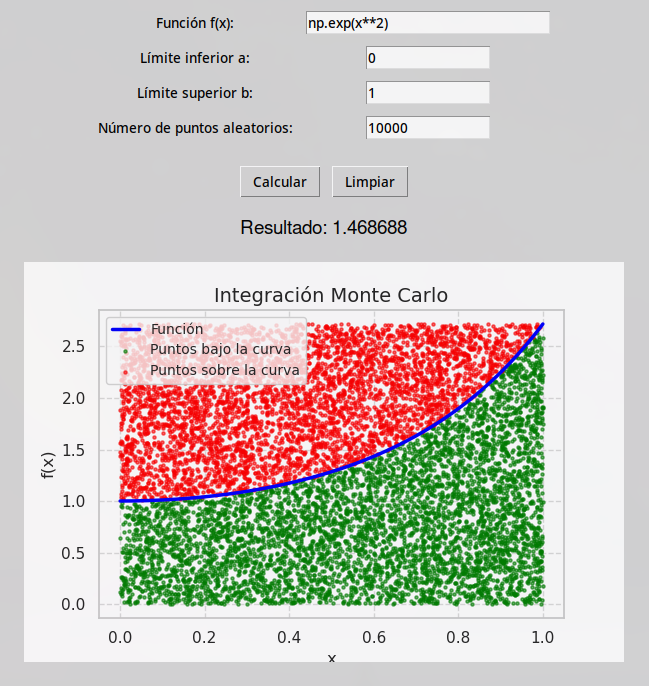
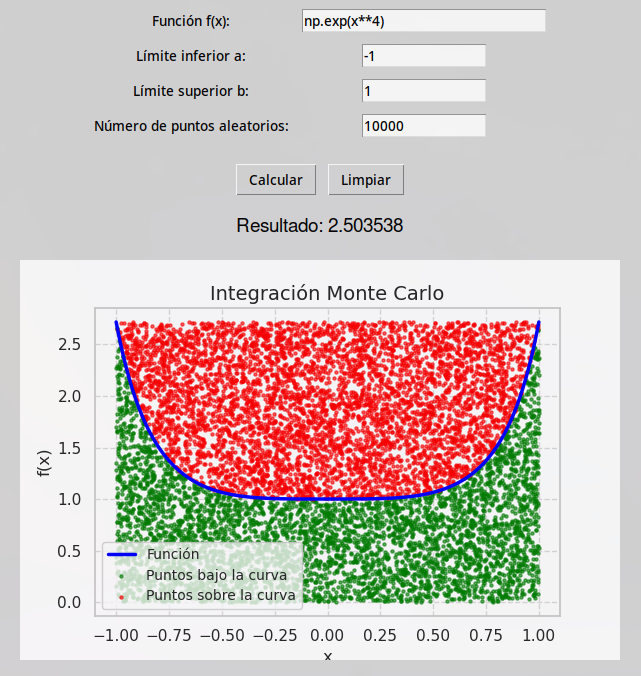
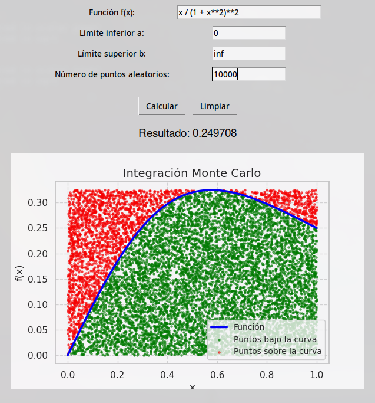

# Informe sobre la Práctica N.º 7: Método de Monte Carlo

## Introducción

El cálculo de integrales es una herramienta esencial en matemáticas y ciencias aplicadas, pero muchas integrales no pueden resolverse analíticamente mediante métodos tradicionales. En estos casos, los métodos numéricos proporcionan una alternativa poderosa para obtener soluciones aproximadas. Entre ellos, el **método de Monte Carlo** se destaca por su capacidad para resolver integrales complejas utilizando simulaciones basadas en números aleatorios. Este enfoque es particularmente útil cuando se trabaja con funciones no elementales o dominios de integración complicados.

La **práctica N.º 7** tiene como objetivo principal el aprendizaje y la aplicación del método de Monte Carlo para resolver una variedad de integrales definidas, incluyendo casos con límites finitos e infinitos. Este método permite estimar valores integrales mediante la generación de puntos aleatorios en el dominio de integración y el cálculo de promedios ponderados, aprovechando la ley de los grandes números para garantizar la convergencia hacia el valor real.

Para llevar a cabo esta práctica, se emplearon herramientas computacionales modernas como Python y sus bibliotecas `NumPy`, `Matplotlib` y `Tkinter`, que facilitan tanto la implementación del método como la visualización gráfica de los resultados obtenidos. Estas herramientas permiten automatizar cálculos complejos y analizar el comportamiento de las soluciones en función del número de muestras generadas.

En este informe se documenta el desarrollo completo de la práctica: desde los fundamentos teóricos del método Monte Carlo hasta su implementación computacional y análisis de resultados.

## Marco Teórico

### Método de Integración por Monte Carlo

El método de integración por Monte Carlo es una técnica numérica que utiliza números aleatorios para estimar el valor de una integral definida. Este enfoque es especialmente útil para resolver integrales complejas, múltiples o impropias, donde los métodos tradicionales pueden ser ineficaces. La base teórica del método radica en la *Ley de los Grandes Números*, que asegura que el promedio de las evaluaciones aleatorias converge al valor real de la integral a medida que aumenta el número de muestras \(N\).

Matemáticamente, para una integral definida \(I = \int_a^b f(x) dx\), el método Monte Carlo aproxima su valor como:

\[
I \approx \frac{b-a}{N} \sum_{i=1}^N f(x_i)
\]

donde \(x_i\) son puntos generados aleatoriamente en el intervalo \([a, b]\). La precisión del método mejora con \(N\), y su error estándar es proporcional a \(N^{-1/2}\), independientemente de la dimensionalidad del problema.

### Integrales No Elementales

En matemáticas, una integral no elemental es aquella cuyo antiderivada no puede expresarse mediante funciones elementales (polinomios, exponenciales, logaritmos, trigonométricas y sus combinaciones finitas). Estas integrales aparecen frecuentemente en problemas reales y requieren métodos numéricos o funciones especiales para su evaluación.

### Herramientas Computacionales

El uso de herramientas computacionales modernas ha facilitado significativamente la implementación del método Monte Carlo y la evaluación de integrales no elementales. En esta práctica se emplearon las bibliotecas de Python:

- `NumPy`: Para realizar cálculos numéricos avanzados y generar números aleatorios necesarios para las simulaciones.
- `Matplotlib`: Para visualizar gráficamente los resultados obtenidos y analizar el comportamiento de las soluciones aproximadas.
- `Tkinter`: Para crear interfaces gráficas que permitan interactuar con los algoritmos desarrollados, mejorando su accesibilidad y usabilidad.

## Desarrollo

### Implementación del Método Monte Carlo

#### Función de Integración Monte Carlo

La función principal encargada de realizar la integración es `monte_carlo_integration`, que implementa el método Monte Carlo.

```python
def monte_carlo_integration(func, a, b, num_points):
    if b == float('inf'):
        transformed_func = lambda t: func(1 / t) / t**2
        a, b = 1e-5, 1  # Transformamos el intervalo a [1e-5, 1]
        func = transformed_func

    x_random = np.random.uniform(a, b, num_points)
    y_max = max(func(x) for x in np.linspace(a, b, 1000))
    y_random = np.random.uniform(0, y_max, num_points)

    under_curve = y_random <= func(x_random)
    area_rectangle = (b - a) * y_max
    integral = (under_curve.sum() / num_points) * area_rectangle

    return integral
```

#### Visualización Gráfica

El programa incluye una funcionalidad para graficar los puntos aleatorios generados y la función evaluada utilizando `Matplotlib`:

```python
ax.plot(x, y, label='Función', color='blue')
ax.scatter(x_random, y_random, color='red', s=1, alpha=0.5, label='Puntos aleatorios')
ax.set_title('Integración Monte Carlo')
ax.set_xlabel('x')
ax.set_ylabel('f(x)')
ax.legend()
```

### Entradas del Usuario

El programa solicita al usuario ingresar la función \(f(x)\), los límites de integración \(a\) y \(b\), y el número de puntos aleatorios. En algunos casos donde el límite superior es infinito (\(b = \infty\)), se reemplaza por un valor finito grande o se transforma el dominio.

Ejemplo de entradas:
- Función: `np.exp(x**2)`
- Límite inferior: `0`
- Límite superior: `1` o `inf`
- Número de puntos aleatorios: `10000`

### Cálculo de Integrales

#### \(I[g(X)] = \int_0^1 e^{x^2} dx\)

Esta integral calcula el área bajo la curva \(e^{x^2}\) en el intervalo \([0, 1]\).

**Parámetros ingresados:**
- Función: `np.exp(x**2)`
- Límite inferior: \(a = 0\)
- Límite superior: \(b = 1\)
- Número de puntos aleatorios: \(10000\)

**Resultado visualizado:**



#### \(I[g(X)] = \int_{-1}^1 e^{x^4} dx\)

Esta integral evalúa \(e^{x^4}\) en el intervalo simétrico \([-1, 1]\).

**Parámetros ingresados:**
- Función: `np.exp(x**4)`
- Límite inferior: \(a = -1\)
- Límite superior: \(b = 1\)
- Número de puntos aleatorios: \(10000\)

**Resultado visualizado:**



#### \(I[g(X)] = \int_0^\infty \frac{x}{(1 + x^2)^2} dx\)

Esta integral evalúa la función \(\frac{x}{(1 + x^2)^2}\) en el intervalo \([0, \infty)\). Para manejar el límite infinito, el programa transforma el dominio utilizando un cambio de variable.

**Parámetros ingresados:**
- Función: `x / (1 + x**2)**2`
- Límite inferior: \(a = 0\)
- Límite superior: \(b = \infty\) (transformado internamente)
- Número de puntos aleatorios: \(10000\)

**Resultado visualizado:**




### \(I[g(X)] = \int_0^1 e^{x + x^2} \, dx\)

Esta integral calcula el área bajo la curva \(e^{x + x^2}\) en el intervalo \([0, 1]\). Los parámetros ingresados fueron:

- Función: `np.exp(x + x**2)`
- Límite inferior: \(a = 0\)
- Límite superior: \(b = 1\)
- Número de puntos aleatorios: \(10000\)

#### Resultado visualizado:

![\(I[g(X)] = \int_0^1 e^{x + x^2} \, dx\)](img/ej5.png)
*Figura: \(I[g(X)] = \int_0^1 e^{x + x^2} \, dx\)*

---

### \(I[g(X)] = \int_0^\infty e^{-x} \, dx\)

Esta integral calcula el área bajo la curva \(e^{-x}\) en el intervalo \([0, \infty)\). El programa maneja el límite infinito transformando el dominio. Los parámetros ingresados fueron:

- Función: `np.exp(-x)`
- Límite inferior: \(a = 0\)
- Límite superior: \(b = \infty\) (transformado internamente)
- Número de puntos aleatorios: \(10000\)

#### Resultado visualizado:

![\(I[g(X)] = \int_0^\infty e^{-x} \, dx\)](img/ej6.png)
*Figura: \(I[g(X)] = \int_0^\infty e^{-x} \, dx\)*

---

### \(I[g(X)] = \int_0^\infty (1 - x^2)^{3/2} \, dx\)

Esta integral evalúa la función \((1 - x^2)^{3/2}\) en el intervalo limitado por la raíz negativa para valores mayores a 1. Por esta razón, se restringe automáticamente a un intervalo válido. Los parámetros ingresados fueron:

- Función: `(1 - x**2)**(3/2)`
- Límite inferior: \(a = 0\)
- Límite superior: \(b = 1\) (ajustado automáticamente)
- Número de puntos aleatorios: \(10000\)

#### Resultado visualizado:

![\(I[g(X)] = \int_0^\infty (1 - x^2)^{3/2} \, dx\)](img/ej7.png)
*Figura: \(I[g(X)] = \int_0^\infty (1 - x^2)^{3/2} \, dx\)*

## Conclusiones

El método de Monte Carlo ha demostrado ser una herramienta útil y eficiente para resolver integrales, especialmente en el caso de funciones complejas o dominios de integración complicados. Las herramientas computacionales utilizadas en esta práctica facilitaron la implementación y visualización de los resultados, permitiendo obtener aproximaciones precisas para integrales definidas, incluso aquellas con límites infinitos. Este método no solo es aplicable en matemáticas, sino que también tiene aplicaciones en áreas como la física, la ingeniería y la estadística.
