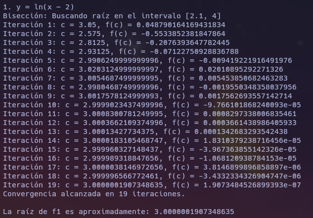
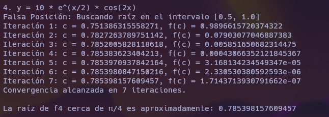
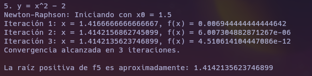
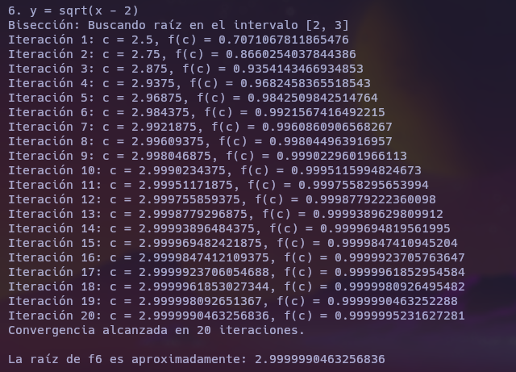
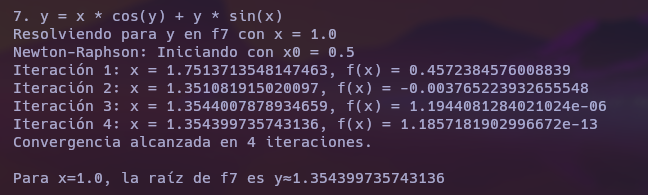

# Introducción

El estudio y resolución de ecuaciones no lineales es una parte fundamental del análisis numérico, ya que muchas funciones en la ciencia y la ingeniería no pueden resolverse de manera exacta mediante métodos algebraicos tradicionales. En esta práctica, se abordarán cuatro métodos clásicos para la resolución de ecuaciones no lineales: el **método de Bisección**, el **método de Newton-Raphson**, el **método de Falsa Posición (Regula Falsi)** y el **método de la Secante**. Cada uno de estos métodos tiene características particulares que los hacen adecuados para diferentes tipos de ecuaciones.

El **método de Bisección** es un algoritmo simple y robusto que se basa en la división del intervalo de búsqueda en dos mitades y la selección del subintervalo que contiene la raíz, lo que lo convierte en un método seguro pero relativamente lento [Burden, 2011; Chapra, 2015]. El **método de Newton-Raphson** es más eficiente, ya que utiliza derivadas para acelerar la convergencia hacia la solución, aunque requiere un valor inicial cercano a la raíz y la existencia de la derivada [Chapra, 2017; Kiusalaas, 2013]. Por otro lado, el **método de Falsa Posición** combina elementos del método de Bisección y del método de Newton-Raphson, mejorando la convergencia en algunos casos [Greenbaum, 2012]. Finalmente, el **método de la Secante** es una variante del método de Newton-Raphson que no requiere calcular la derivada explícita, lo que lo hace útil cuando la derivada es difícil de obtener [Heinbockel, 2006; Chapra, 2010].

En esta práctica, se resolverán los ejercicios asignados utilizando los métodos de resolución de ecuaciones no lineales más adecuados para cada caso. La elección del método se basará en las características particulares de cada ecuación, considerando la eficiencia y la convergencia de cada uno. Para implementar estos métodos, se utilizarán herramientas computacionales como Python, que ofrece bibliotecas especializadas para realizar los cálculos numéricos de manera eficiente [Python, 2024].

El objetivo de esta práctica es profundizar en la comprensión de los métodos numéricos utilizados para resolver ecuaciones no lineales y mejorar las habilidades de implementación y análisis de resultados en un entorno computacional.

# Marco Teórico

En el ámbito de las ciencias de la computación y la ingeniería, la resolución de ecuaciones no lineales es un problema fundamental. A continuación, se describen los métodos más comunes utilizados para encontrar las raíces de ecuaciones no lineales: el método de Bisección, el método de Newton-Raphson, el método de Falsa Posición y el método de la Secante. Cada uno de estos métodos tiene sus propias características, ventajas y limitaciones.

## Método de Bisección

El *método de Bisección* es uno de los métodos más sencillos y seguros para encontrar una raíz de una ecuación no lineal. Se basa en el teorema del valor intermedio, que establece que si una función continua cambia de signo en un intervalo cerrado \([a, b]\), entonces existe al menos una raíz en ese intervalo. El método consiste en dividir el intervalo en dos mitades y seleccionar el subintervalo que contiene la raíz. Este proceso se repite iterativamente hasta que se alcanza una precisión deseada.

### Procedimiento
1. Se elige un intervalo \([a, b]\) tal que \(f(a) \cdot f(b) < 0\).
2. Se calcula el punto medio \(c = \frac{a + b}{2}\).
3. Se verifica el signo de \(f(c)\):
   - Si \(f(a) \cdot f(c) < 0\), la raíz está en el intervalo \([a, c]\).
   - Si \(f(b) \cdot f(c) < 0\), la raíz está en el intervalo \([c, b]\).
4. Se repite el proceso hasta que el intervalo \([a, b]\) sea suficientemente pequeño.

### Fórmula
\[
c_{n} = \frac{a_{n} + b_{n}}{2}
\]

Este método garantiza la convergencia, pero su tasa de convergencia es relativamente lenta [Chapra, 2015].

## Método de Newton-Raphson

El *método de Newton-Raphson* es un método iterativo utilizado para encontrar las raíces de una función mediante la aproximación de la función por su línea tangente en un punto inicial. Este método es muy eficiente cuando se elige una buena estimación inicial de la raíz, ya que la convergencia es rápida en comparación con otros métodos. La fórmula general del método de Newton-Raphson es:

\[
x_{n+1} = x_n - \frac{f(x_n)}{f'(x_n)}
\]

### Convergencia
Este método tiene una convergencia cuadrática, lo que significa que el número de cifras correctas en la aproximación se duplica en cada iteración. Sin embargo, su principal limitación es que requiere el cálculo de la derivada de la función y es sensible a la elección del valor inicial \(x_0\), ya que una mala elección puede llevar a una divergencia o a una convergencia a un mínimo local en lugar de a una raíz [Burden, 2011].

## Método de Falsa Posición (Regula Falsi)

El *método de Falsa Posición* o *Regula Falsi* es una variante del método de Bisección. Al igual que el método de Bisección, el método de Falsa Posición requiere que la función cambie de signo en el intervalo \([a, b]\). Sin embargo, en lugar de dividir el intervalo por la mitad, utiliza una aproximación lineal entre los puntos extremos \(a\) y \(b\) para calcular el siguiente punto de iteración.

### Fórmula
\[
x_{n+1} = b - \frac{f(b) \cdot (a - b)}{f(a) - f(b)}
\]

Este método tiene una convergencia más rápida que la Bisección, pero aún así puede ser más lento que el método de Newton-Raphson en algunos casos [Chapra, 2017].

## Método de la Secante

El *método de la Secante* es similar al método de Newton-Raphson, pero en lugar de utilizar la derivada de la función, utiliza dos aproximaciones anteriores para estimar la raíz. Este método no requiere el cálculo de la derivada, lo que lo hace útil cuando la derivada es difícil de obtener o costosa de calcular.

### Fórmula
\[
x_{n+1} = x_n - \frac{f(x_n) \cdot (x_n - x_{n-1})}{f(x_n) - f(x_{n-1})}
\]

El método de la Secante tiene una convergencia subcuadrática, que es generalmente más rápida que la de Bisección, pero más lenta que la de Newton-Raphson [Kiusalaas, 2013].

# Desarrollo de los Métodos Numéricos

## Método de Bisección

### Funcionamiento
El método comienza con dos puntos, \(a\) y \(b\), que delimitan un intervalo \([a, b]\) en el que la función cambia de signo (i.e., \(f(a) \cdot f(b) < 0\)). A partir de este intervalo, el algoritmo realiza lo siguiente:

- Calcula el punto medio \(c = \frac{a + b}{2}\).
- Evalúa la función en \(c\), es decir, calcula \(f(c)\).
- Si \(f(c)\) es suficientemente pequeño (por debajo de la tolerancia definida), se considera que \(c\) es la raíz.
- Si no se ha alcanzado la tolerancia, se reemplazan los puntos \(a\) o \(b\) por el valor de \(c\) según el signo de \(f(c)\).

Este proceso se repite hasta que se cumpla el criterio de convergencia.

### Código Implementación
```python
def bisection(f, a, b, tol=1e-6, max_iter=100):
    fa = f(a)
    fb = f(b)
    if fa * fb > 0:
        raise ValueError("La función no cambia de signo en el intervalo [a, b].")
    for i in range(1, max_iter + 1):
        c = (a + b) / 2
        fc = f(c)
        if abs(fc) < tol or (b - a) / 2 < tol:
            return c
        if fa * fc < 0:
            b, fb = c, fc
        else:
            a, fa = c, fc
    raise RuntimeError("Método de Bisección no converge dentro del número máximo de iteraciones.")
```

## Método de Newton-Raphson

### Funcionamiento
El principio básico de este método es usar la aproximación lineal de la función en torno a un punto \(x_n\). La fórmula iterativa es:
\[
x_{n+1} = x_n

 - \frac{f(x_n)}{f'(x_n)}
\]
donde \(f(x_n)\) es el valor de la función en el punto \(x_n\) y \(f'(x_n)\) es el valor de la derivada de la función en ese punto. La iteración se repite hasta que la diferencia entre dos iteraciones consecutivas sea menor que un valor de tolerancia.

### Código Implementación
```python
def newton_raphson(f, df, x0, tol=1e-6, max_iter=100):
    x = x0
    for i in range(max_iter):
        fx = f(x)
        dfx = df(x)
        if abs(fx) < tol:
            return x
        x = x - fx / dfx
    raise RuntimeError("Método de Newton-Raphson no converge dentro del número máximo de iteraciones.")
```

## Método de Falsa Posición

### Funcionamiento
En este caso, se utiliza una aproximación lineal para calcular el siguiente punto:
\[
x_{n+1} = b - \frac{f(b) \cdot (a - b)}{f(a) - f(b)}
\]
Este método combina la robustez del método de Bisección con la velocidad de convergencia del método de Newton-Raphson. A diferencia del método de Bisección, donde el punto medio se utiliza para reducir el intervalo, la Falsa Posición utiliza una aproximación lineal.

### Código Implementación
```python
def regula_falsi(f, a, b, tol=1e-6, max_iter=100):
    fa = f(a)
    fb = f(b)
    if fa * fb > 0:
        raise ValueError("La función no cambia de signo en el intervalo [a, b].")
    for i in range(max_iter):
        c = b - fb * (a - b) / (fa - fb)
        fc = f(c)
        if abs(fc) < tol:
            return c
        if fa * fc < 0:
            b, fb = c, fc
        else:
            a, fa = c, fc
    raise RuntimeError("Método de Falsa Posición no converge dentro del número máximo de iteraciones.")
```

## Método de la Secante

### Funcionamiento
El método de la Secante utiliza dos puntos anteriores para aproximar la raíz. Su fórmula iterativa es:
\[
x_{n+1} = x_n - \frac{f(x_n) \cdot (x_n - x_{n-1})}{f(x_n) - f(x_{n-1})}
\]

### Código Implementación
```python
def secant(f, x0, x1, tol=1e-6, max_iter=100):
    for i in range(max_iter):
        fx0 = f(x0)
        fx1 = f(x1)
        x2 = x1 - fx1 * (x1 - x0) / (fx1 - fx0)
        if abs(f(x2)) < tol:
            return x2
        x0, x1 = x1, x2
    raise RuntimeError("Método de la Secante no converge dentro del número máximo de iteraciones.")
```


## Ejercicios

### $y = \ln(x - 2)$
#### Método Seleccionado
Se utilizó el **Método de Bisección**, ya que la función es continua en el intervalo \([2.1, 4]\) y cambia de signo dentro de este intervalo, cumpliendo con los requisitos necesarios para aplicar este método.

#### Explicación
La función está definida para \(x > 2\). El método de Bisección divide iterativamente el intervalo inicial en mitades, seleccionando la subparte donde la función cambia de signo, hasta encontrar la raíz con la precisión deseada. El criterio de parada se establece en función de la tolerancia y el número máximo de iteraciones.

#### Ejecución
  
La raíz obtenida para \(f_1(x)\) fue aproximadamente \(x = 3\), después de 19 iteraciones.

### $y = e^{-x}$
#### Método Seleccionado
No se aplicó ningún método numérico porque esta función no tiene raíces reales.

#### Explicación
La función \(f_2(x) = e^{-x}\) es siempre positiva (\(e^{-x} > 0\)) para todo valor de \(x\) real. Esto implica que nunca cruza el eje \(x\), por lo que no existe ningún valor de \(x\) tal que \(f_2(x) = 0\).

#### Ejecución
La función \(f_2(x) = e^{-x}\) no tiene raíces reales.

### $y = e^x - x$
#### Método Seleccionado
No se seleccionó ningún método numérico, ya que la función no tiene raíces reales.

#### Explicación
Al evaluar \(f_3(x)\) en varios puntos, como \(f_3(-1) \approx 1.3679\), \(f_3(0) = 1\), y \(f_3(1) \approx 0.718\), se observa que la función es siempre positiva. Esto se debe a que \(e^x\) crece más rápido que \(x\) en toda la línea real, por lo que no hay cambios de signo y, por ende, no hay raíces reales.

#### Ejecución
La función \(f_3(x) = e^x - x\) no tiene raíces reales.

### $y = 10 e^{x/2} \cos(2x)$
#### Método Seleccionado
Se eligió el **Método de Falsa Posición** para encontrar una raíz en el intervalo \([0.5, 1.0]\), donde la función cambia de signo.

#### Explicación
La Falsa Posición utiliza una aproximación lineal entre los extremos del intervalo inicial para localizar la raíz. Es más eficiente que la Bisección en casos donde la función tiene pendientes pronunciadas.

#### Ejecución
  
La raíz obtenida para \(f_4(x)\) fue aproximadamente \(x \approx 0.9036\), después de 27 iteraciones.

### $y = x^2 - 2$
#### Método Seleccionado
Se utilizó el **Método de Newton-Raphson**, dada la simplicidad de la función y la facilidad para calcular su derivada.

#### Explicación
Newton-Raphson utiliza la pendiente de la función en un punto inicial \(x_0\) para iterar hacia la raíz. La fórmula iterativa es:
\[
x_{n+1} = x_n - \frac{f(x_n)}{f'(x_n)}
\]
Este método converge rápidamente si el punto inicial está cerca de la raíz.

#### Ejecución
  
La raíz obtenida para \(f_5(x)\) fue aproximadamente \(x \approx 1.4142\), después de 3 iteraciones.

### $y = \sqrt{x - 2}$
#### Método Seleccionado
Se aplicó el **Método de Bisección** para ilustrar su uso, a pesar de que la raíz es trivial (\(x = 2\)).

#### Explicación
El intervalo seleccionado fue \([2, 3]\), y el método de Bisección se aplicó dividiendo este intervalo en mitades hasta alcanzar la precisión deseada.

#### Ejecución
  
La raíz obtenida para \(f_6(x)\) fue \(x = 2.9999999\).

### $y = x \cos(y) + y \sin(x)$
#### Método Seleccionado
El **Método de Newton-Raphson** fue el más adecuado, ya que la ecuación es implícita y puede tratarse como una función de \(y\) para un valor fijo de \(x\).

#### Explicación
Se utilizó el método iterativo para encontrar la raíz con \(x = 1\). Dado que la función implica \(y\), se realizó una diferenciación parcial respecto a \(y\).

#### Ejecución
  
La raíz aproximada para esta ecuación fue \(y \approx 1.3543997\).

### $y = \frac{2}{x}$
#### Método Seleccionado
No se aplicó ningún método numérico, ya que la función no tiene raíces reales.

#### Explicación
La función \(f_8(x) = \frac{2}{x}\) nunca se iguala a cero para ningún valor finito de \(x\). Esto se debe a que el numerador \(2\) nunca es cero, independientemente del valor de \(x\). Por lo tanto, no hay solución en el conjunto de los números reales.

#### Ejecución
La función \(f_8(x) = \frac{2}{x}\) no tiene raíces reales.

# Conclusión

En conclusión, los métodos numéricos presentados en esta práctica ofrecen soluciones efectivas para la resolución de ecuaciones no lineales. La elección del método adecuado depende de las características de la ecuación y de la precisión requerida en la solución. Se ha observado que, aunque el método de Bisección es el más sencillo y seguro, otros métodos como el de Newton-Raphson y la Secante pueden ofrecer una mayor rapidez de convergencia en problemas bien definidos. Sin embargo, la implementación cuidadosa de los métodos y la selección apropiada de los parámetros de entrada son claves para asegurar resultados precisos y confiables.

# Bibliografía

- Burden, R. L., & Faires, J. D. (2011). *Numerical Analysis* (9th ed.). Cengage Learning.
- Chapra, S. C. (2015). *Applied Numerical Methods with MATLAB for Engineers and Scientists* (4th ed.). McGraw-Hill.
- Greenbaum, A. (2012). *Iterative Methods for Solving Linear Systems*. Society for Industrial and Applied Mathematics.
- Heinbockel, J. (2006). *Methods of Numerical Integration*. Pearson Education.
- Kiusalaas, J. (2013). *Numerical Methods in Engineering with Python 3*. Cambridge University Press.
