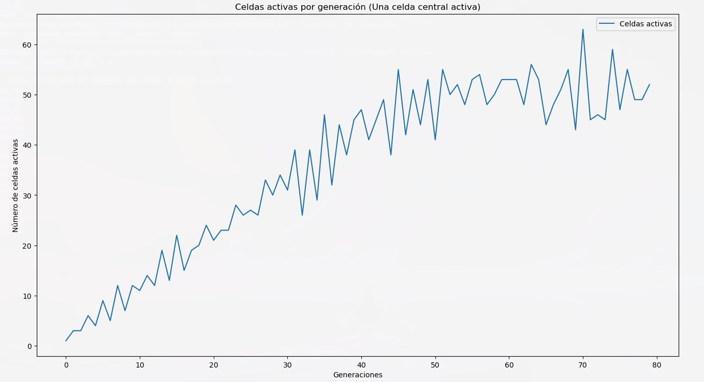
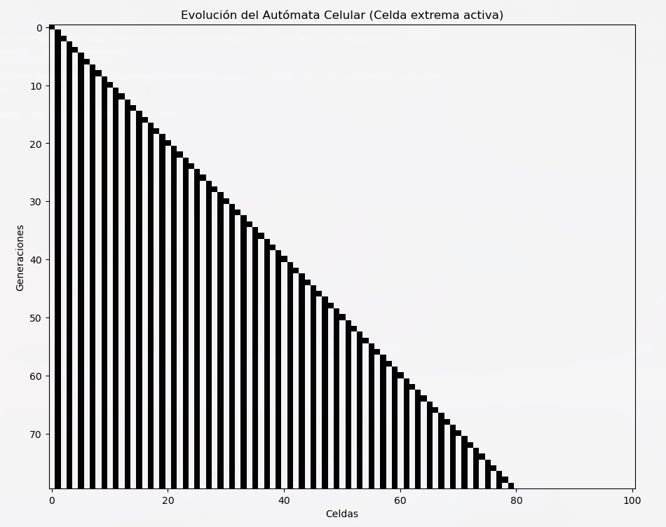

# Introducción

Los autómatas celulares son modelos matemáticos que permiten simular y analizar sistemas complejos a partir de reglas simples y locales. Introducidos por John von Neumann y Stanislaw Ulam en la década de 1940, y popularizados por Stephen Wolfram en *A New Kind of Science*, estos modelos han encontrado aplicaciones en diversos campos, como la biología, la física, la computación y la teoría de sistemas.

Un autómata celular consiste en una rejilla de celdas donde cada una puede estar en un estado discreto. El estado de cada celda evoluciona en pasos discretos de tiempo, determinados por un conjunto de reglas que dependen de los estados de las celdas vecinas. Esta dinámica genera patrones emergentes que pueden ser útiles para estudiar fenómenos como la propagación de enfermedades, la dinámica de fluidos o el comportamiento de sistemas ecológicos.

En esta práctica se implementó un autómata celular unidimensional en Python utilizando las bibliotecas NumPy y Matplotlib. Se definieron reglas específicas para la evolución del sistema, y se analizaron patrones generados a partir de distintas configuraciones iniciales. El objetivo principal fue explorar cómo las reglas locales pueden generar estructuras complejas y cuantificar el comportamiento del sistema mediante métricas como el número de celdas activas por generación.

Este informe busca proporcionar una comprensión básica de los autómatas celulares y sus aplicaciones, destacando el impacto de las condiciones iniciales y las reglas de transición en la evolución del sistema.

# Desarrollo

## Implementación del Autómata Celular

El autómata celular fue implementado en Python utilizando una función que permite simular su evolución según una regla predefinida. A continuación, se presentan los resultados de seis configuraciones iniciales distintas y los patrones generados.

### Una celda central activa

En este caso, el autómata comienza con una única celda activa ubicada en el centro de la rejilla.

#### Visualización de los Resultados

_Figura 1: Evolución del autómata celular: Una celda central activa._

_Figura 2: Celdas activas por generación: Una celda central activa._

---

### Dos celdas juntas

El autómata comienza con dos celdas activas ubicadas de forma contigua en el centro de la rejilla.

#### Visualización de los Resultados

_Figura 3: Evolución del autómata celular: Dos celdas juntas._

_Figura 4: Celdas activas por generación: Dos celdas juntas._

---

### Celdas alternantes

El autómata comienza con celdas activas dispuestas de forma alternante alrededor del centro de la rejilla.

#### Visualización de los Resultados

_Figura 5: Evolución del autómata celular: Celdas alternantes._

_Figura 6: Celdas activas por generación: Celdas alternantes._

---

### Bloque continuo de celdas activas

El autómata comienza con un bloque continuo de celdas activas en el centro de la rejilla.

#### Visualización de los Resultados

_Figura 7: Evolución del autómata celular: Bloque continuo de celdas activas._

_Figura 8: Celdas activas por generación: Bloque continuo de celdas activas._

---

### Celda extrema activa

En este caso, el autómata comienza con una única celda activa en el borde izquierdo de la rejilla.

#### Visualización de los Resultados

_Figura 9: Evolución del autómata celular: Celda extrema activa._

_Figura 10: Celdas activas por generación: Celda extrema activa._

---

### Celda activa en el borde derecho

El autómata comienza con una única celda activa ubicada en el borde derecho de la rejilla.

#### Visualización de los Resultados

_Figura 11: Evolución del autómata celular: Celda activa en el borde derecho._

_Figura 12: Celdas activas por generación: Celda activa en el borde derecho._

# Conclusiones

En esta práctica se implementó un autómata celular unidimensional con diferentes configuraciones iniciales y se analizó su evolución a lo largo de 80 generaciones. Los resultados permitieron observar lo siguiente:

1. La configuración inicial tiene un impacto significativo en la dinámica del sistema, generando patrones que varían desde estructuras simples y simétricas hasta distribuciones densas y complejas.
2. El análisis de las celdas activas por generación reveló tendencias específicas para cada configuración. Las distribuciones iniciales dispersas tienden a generar fluctuaciones, mientras que las densas muestran un crecimiento más uniforme.
3. La visualización de los resultados permitió identificar patrones emergentes y analizar la interacción de las celdas activas en diferentes configuraciones.
4. Las herramientas computacionales utilizadas, como Python, NumPy y Matplotlib, demostraron ser efectivas para modelar y analizar sistemas dinámicos como los autómatas celulares.

En general, esta práctica sirvió para comprender cómo reglas simples y condiciones iniciales específicas pueden generar comportamientos dinámicos complejos, resaltando el valor de los autómatas celulares como herramientas de modelado.

